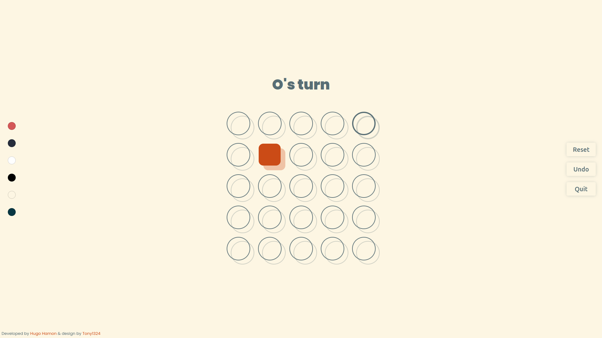

# Tic-Tac-Toe

## Description

Tic-Tac-Toe is a Python implementation of the Tic-Tac-Toe game with the Eel graphical interface. A game can be played either against another player or against an AI based on various algorithms. The game is fully customizable through a toml configuration file.

The project includes the following elements:

- The basic Tic-Tac-Toe game
- Several AI algorithms including:
    - Minimax
    - Negamax
    - Alpha-Beta Pruning
    - Monte Carlo Tree Search
    - AlphaZero
- A toml configuration file to customize the game
- Several graphical themes
- Shell interface to play the game

## Game Previews

### 5x5 Game


### 3x3 Game


### Game Against AlphaZero


## Installation

This project was developed with Python 3.10.0 and it is recommended to use a virtual environment to install the dependencies.

1. Clone the project and navigate to the directory:

```bash
- git clone https://github.com/hugo-hamon/TicTacToe.git
- cd TicTacToe
```

2. Create a virtual environment and activate it:
    
- For Linux and macOS:
```bash
python3 -m venv venv
source venv/bin/activate
```
- For Windows:
```bash
python3 -m venv venv
.\venv\Scripts\activate
```

3. Install the necessary dependencies using `requirements.txt`:
```bash
pip install -r requirements.txt
```

## Usage

To launch the game, run the `run.py` file:

```bash
cd project
python run.py
```

## Configuration

The `config` folder contains various pre-made configuration files, but you can create new ones or modify existing ones.

## Credits

This project was developed by `Hugo Hamon`, the graphical interface was developed by `Tony1324`, thanks to him for his work and his permission to use it. You can find his work on his [GitHub](https://github.com/Tony1324) and the tutorial video on [YouTube](https://youtu.be/4536nb0U2cQ?si=3mbp0cOwmaP42AKF).

## License

This project is licensed under the MIT License - see the [LICENSE](LICENSE) file for more details.